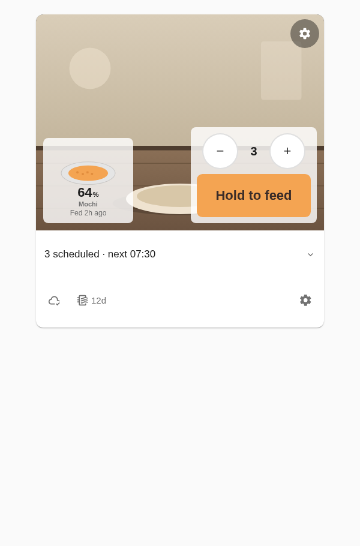
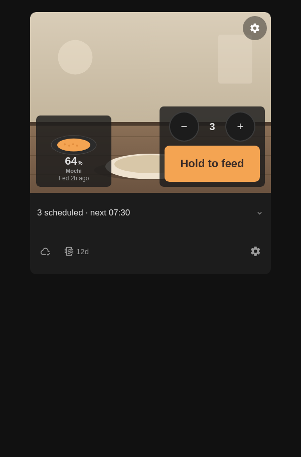
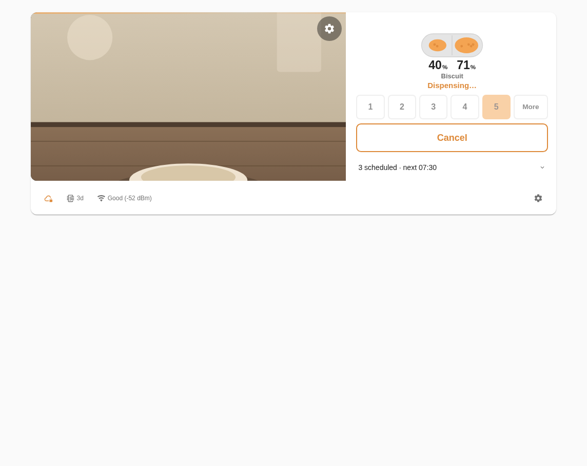
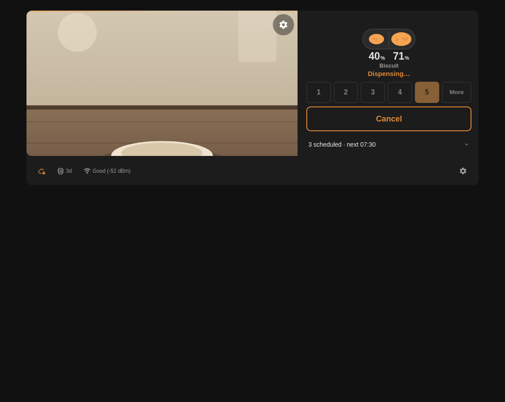
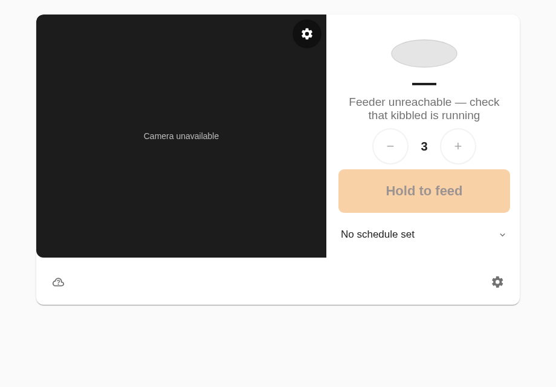
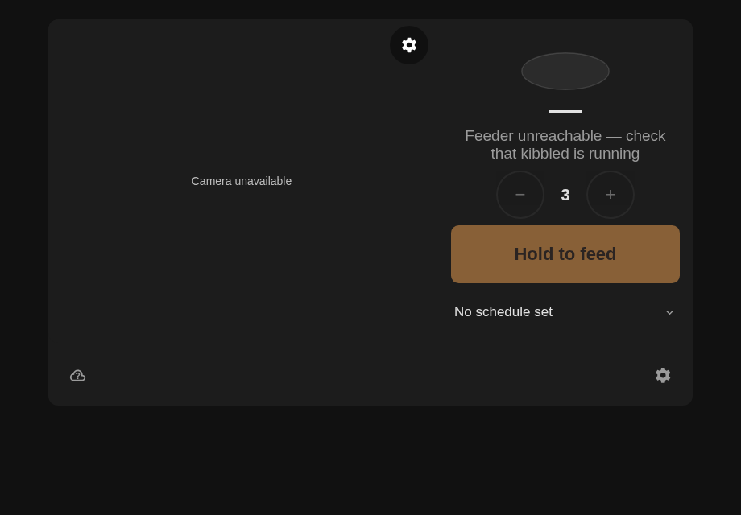
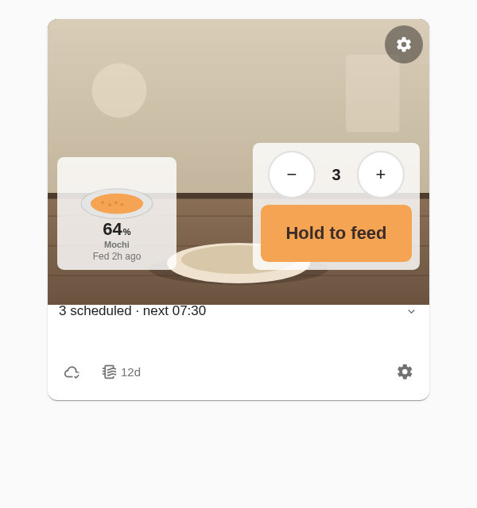
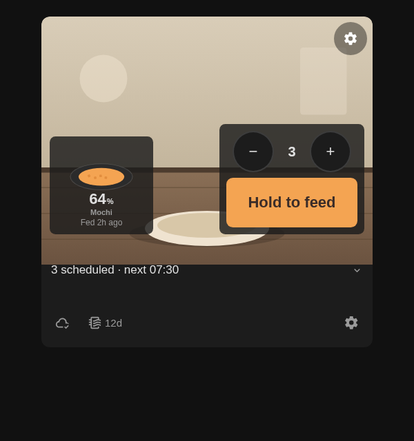

# Kibble Card

A Lovelace card for the [Kibble](https://github.com/nphil/kibble) Petkit feeder integration — the
full daily control surface, not a bag of switches. One illustrated bowl (fill level, split
chambers, a peeking cat when one's been seen recently), a live camera hero, a press-and-hold feed
action, and a one-line schedule summary. Everything secondary (per-hopper feed, night vision,
microphone, volume, cloud, Wi-Fi/desiccant detail) lives behind the settings gear.

The card is one responsive component — no layout config. Container queries drive three width
bands (stacked under 360px, camera-hero-with-overlay from 360–640px, two-column above 640px), and
a height-aware scale step enlarges type and touch targets once the card's own box clears ~440px
tall — the kiosk/panel case, e.g. an ESPHome touch display running a single-card dashboard.

## Install (HACS)

1. HACS → Frontend → ⋮ → Custom repositories → add `https://github.com/nphil/kibble-card`.
2. Install "Kibble Card", then add it as a Lovelace resource if HACS doesn't do so automatically
   (Settings → Dashboards → Resources → `/hacsfiles/kibble-card/kibble-card.js`, type: JavaScript
   Module).
3. Add the card to a dashboard:

   ```yaml
   type: custom:kibble-card
   device_id: <your Kibble device>
   # name: Plant room       # optional label shown on the camera
   ```

   Or use the visual editor — the only field is the device picker. Every entity id is resolved
   from the device at render time; you never type one.

## What it looks like

Rendered against a mock `hass` (see [`dev/`](dev)) at every required width/theme/state
combination — [`screenshots/`](screenshots) has the full set. A representative sample:

| | Light | Dark |
|---|---|---|
| Idle, phone width (480px) |  |  |
| Dispensing, two-column (1024px) |  |  |
| Unreachable, 800×480 kiosk panel |  |  |
| Idle, 480×480 kiosk panel |  |  |

The dispensing screenshots show the split-bowl path (the two augers reading more than 5 points
apart); every other state shows the single shared-bowl path, matching the feeder's divider-removed
reality.

## Design

- **The bowl is the status.** A custom SVG (traced from the integration's own brand icon — same
  cat ears/head, same rounded-square kibble-piece motif) shows fill level, splits into two
  chambers only when the augers disagree by 5 points or more, and gets a small ink cat silhouette
  when `last_seen_pet` names someone. A one-shot, ~900ms kibble-drop animation plays once when a
  feed starts, skipped entirely under `prefers-reduced-motion`.
- **Three actions on the face:** a 1–5 segmented portion picker (or a big +/− stepper wherever six
  48px+ segments genuinely don't fit — both read the same `number.feed_amount` entity live), the
  press-and-hold feed button (600ms, the anti-accident lock for a touchscreen a cat can step on;
  becomes **Cancel** on a single tap while dispensing), and the schedule one-liner.
- **Everything else is behind the gear**: per-hopper feed (the wear-leveling/jam-workaround case),
  night vision / status LED / microphone, volume, the Petkit cloud switch (tap-twice confirm — it
  opens/closes an external pathway), Wi-Fi and desiccant detail, before/after dish photos and the
  speaker when the integration ships them, and a link to the device page.
- **Colour is the host theme.** Every structural colour is an HA theme variable
  (`--ha-card-background`, `--primary-text-color`, `--secondary-text-color`, `--divider-color`,
  `--primary-color`, `--ha-card-border-radius`, `--ha-card-box-shadow`). Amber is the one fixed
  accent (feed action, dispensing state, the cloud-blocked footer glyph); everything on top of the
  live camera (the gear, the name chip) uses a fixed dark scrim + white ink, the same treatment
  every video UI uses, independent of app theme.
- **Degrades honestly.** A camera-less device shows "No camera on this device," not a blank box.
  An unreachable agent shows "Feeder unreachable — check that kibbled is running" and disables the
  feed controls (the persisted portion amount still shows — it's HA-local `RestoreEntity` state,
  not device-backed, per `number.py`). Entities the integration hasn't shipped yet (`last_seen_pet`,
  per-cat presence, dish photos, the speaker, Wi-Fi) are resolved defensively and simply don't
  render a section when absent.

## Schedule card integration

Tapping the schedule line expands either the embedded
[`dispenser-schedule-card`](https://github.com/cristianchelu/dispenser-schedule-card) or, when
that card isn't installed, a plain fallback list built straight from `sensor.…_schedule`'s
`entries` attribute — the fallback always works and needs nothing from the integration.

The embed needs one thing the integration doesn't expose yet: `dispenser-schedule-card`'s
`device.type: custom` adapter reads a **packed, regex-parseable string from an entity's `state`**
(`"<id>,<hour>,<minute>,<amount>,<status>;..."`), and our `sensor.…_schedule`'s state is
deliberately the entry count, with the rich list living in an attribute — an attribute the card
can't read at all (it only ever looks at `.state`). So this card looks for a *second*,
purpose-built entity (`translation_key: "schedule_card_state"`, resolved automatically once it
exists) and only activates the embed when that entity is present and available; until then, the
fallback list is what everyone sees, which is complete and honest today.

If the schedule surface owner wants the embed live, here's the exact shape this card already
targets:

- A new sensor (e.g. `sensor.…_schedule_card_state`) whose **state** is entries packed as
  `id,hour,minute,amount,status;id,hour,minute,amount,status;...` (comma inside a field is not
  safe — ids must avoid it).
- One `amount` per entry, not two — mirror `hopper1_g`/`hopper2_g` together on writes through this
  path. This isn't a lossy compromise: it's the same "one shared bin" simplification the primary
  Feed button already makes, given the physical divider is removed. Per-auger schedule tuning stays
  a power-user path outside this card.
- `status` can be a constant `2` (pending) for every entry until real per-entry dispatch tracking
  exists — the card's own client-side logic still correctly derives "skipped" (pending + time
  passed) from that alone. "Dispensed"/"failed" distinction is a real enhancement, not a blocker.
- New thin adapter services — `kibble.schedule_card_add` / `_edit` / `_remove` / `_toggle`, each
  taking exactly `id, hour, minute, amount` — rather than reshaping the existing
  `schedule_add`/`schedule_remove`/`schedule_set_enabled` services (whose `time`/`hopper1_g`/
  `hopper2_g` fields other consumers already depend on). `edit` has no existing equivalent
  (`schedule_add` is deliberately not an upsert) and would need to be new regardless.

The card's exact proposed `dispenser-schedule-card` config lives in
[`src/components/kibble-schedule-summary.ts`](src/components/kibble-schedule-summary.ts).

## Development

```sh
bun install
bun run typecheck        # src/ + dev/, browser DOM lib only
bun run typecheck:test    # test/ + src/lib/, with bun-types for bun:test
bun test                  # pure-logic unit tests (entity resolution, schedule math, feeding state)
bun run build              # dist/kibble-card.js, minified, Lit bundled in
```

### Local visual harness

No real Home Assistant needed — `dev/` renders the card against a mock `hass` built from
fixtures matching the live entity model, with a `callService` that logs (and, for `number.set_value`
/ `switch.toggle`, actually mutates the mock state so clicking around behaves like the real thing).

```sh
bun run harness   # builds both bundles, serves dev/ at http://localhost:4173
```

Then open `http://localhost:4173/?scenario=idle&theme=light&width=480` — query params:
`scenario` (`idle` | `dispensing` | `unreachable`), `theme` (`light` | `dark`), `width`, `height`
(omit for natural content height; set both for a fixed kiosk-panel box), `name` (optional label).
