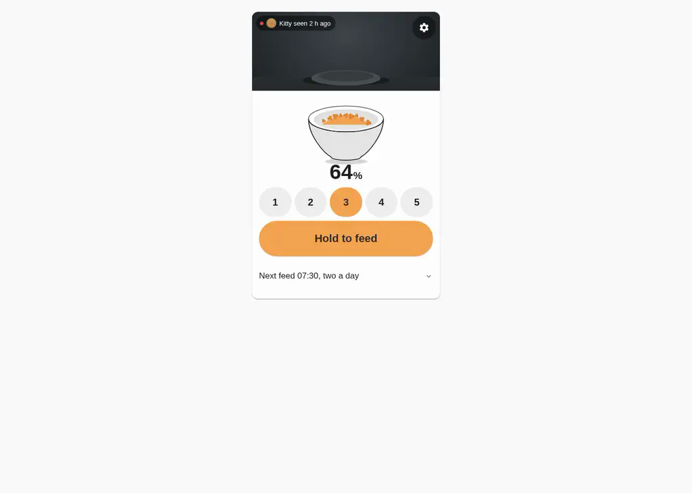
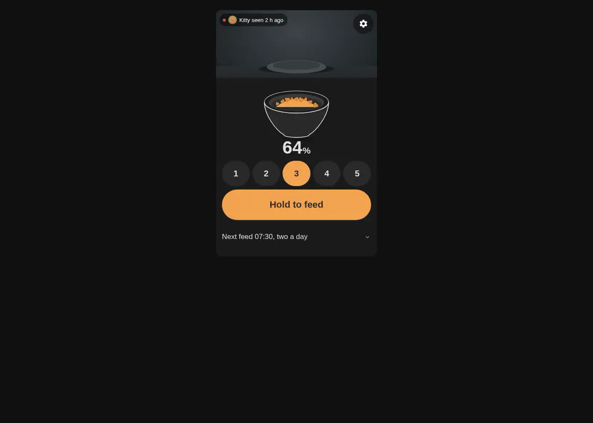
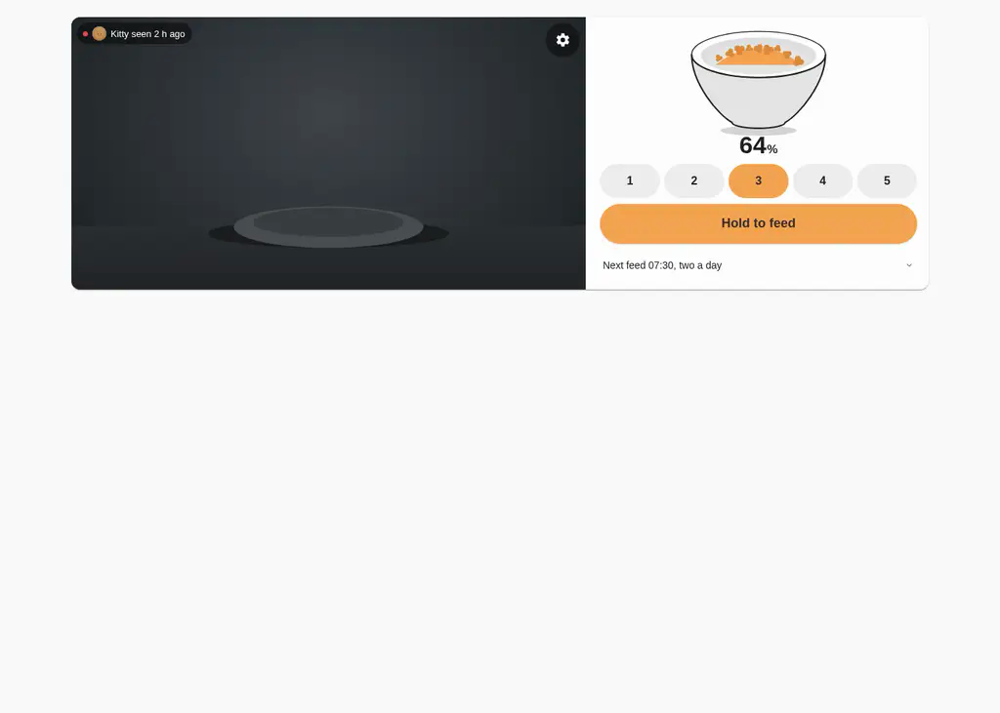
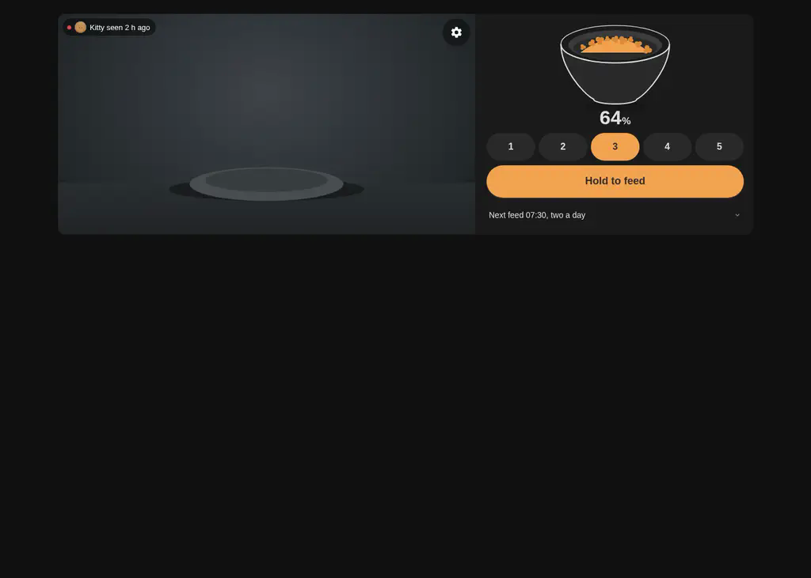
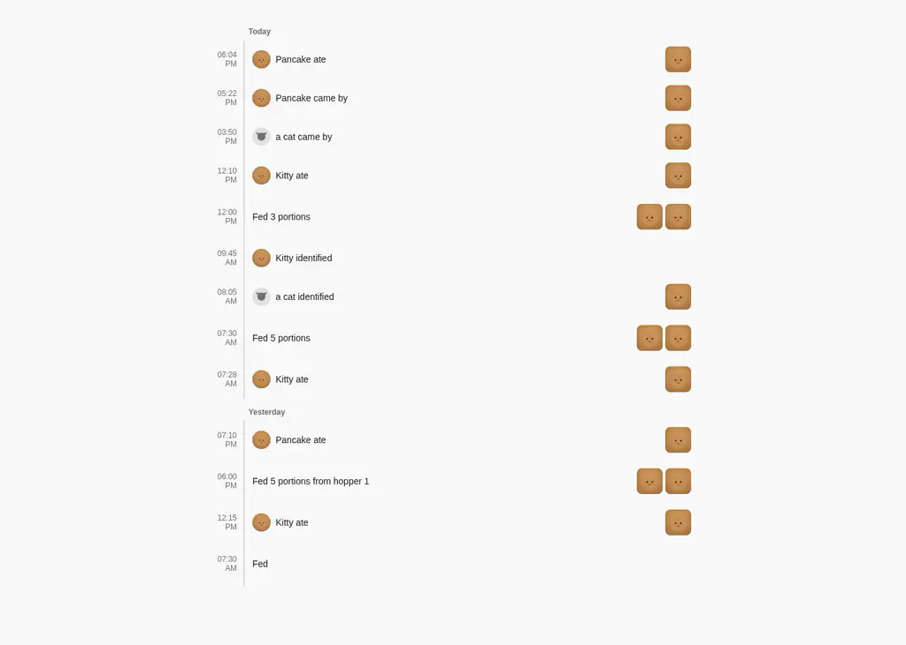
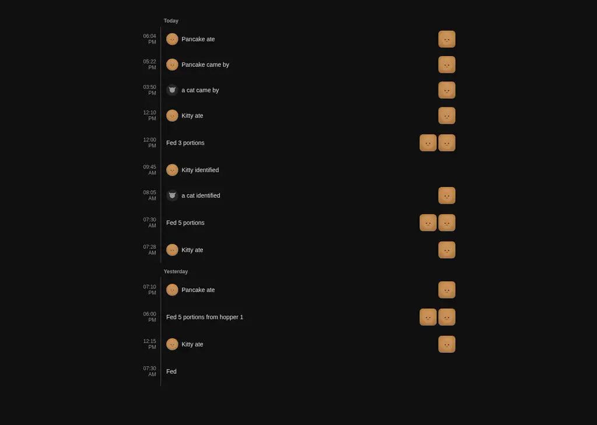
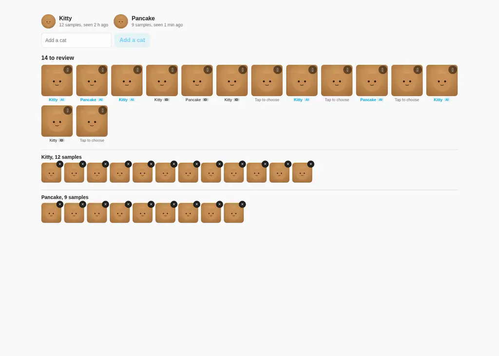
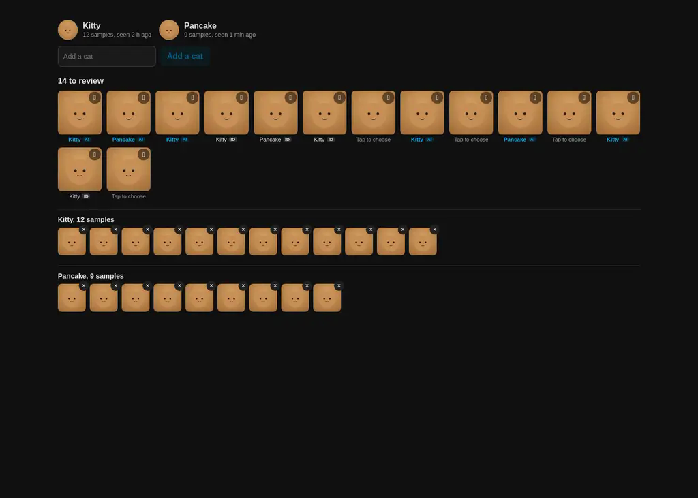

# Kibble Card

Three Lovelace cards for the [Kibble](https://github.com/nphil/kibble) Petkit feeder integration:
`kibble-card` (the daily hero — live camera with a "who's been by" overlay, bowl status, feed,
schedule), `kibble-timeline-card` (today's feeds and visits as one rail, with photos), and
`kibble-cats-card` (enrolled cats plus a one-tap training inbox for the feeder's own face crops).
Full design rationale in [`DESIGN.md`](DESIGN.md).

Every card is one responsive component — no layout config beyond the device picker and a couple
of optional fields. Container queries drive the responsive behavior, never viewport queries.

## Install (HACS)

1. HACS → Frontend → ⋮ → Custom repositories → add `https://github.com/nphil/kibble-card`.
2. Install "Kibble Card", then add it as a Lovelace resource if HACS doesn't do so automatically
   (Settings → Dashboards → Resources → `/hacsfiles/kibble-card/kibble-card.js`, type: JavaScript
   Module).
3. Add whichever cards you want to a dashboard:

   ```yaml
   type: custom:kibble-card
   device_id: <your Kibble device>
   # scrypted_id: "238"           # optional: Scrypted device id of the feeder camera — turns the
   #                              # hero into a live WebRTC stream with hold-to-talk (see below)
   # name: Plant room             # optional label shown on the camera
   # settings_hash: "#settings"   # optional: gear opens this Bubble Card pop-up instead of the in-card dialog
   # schedule_hash: "#schedule"   # optional: same, for the "Next feed" line
   ```

   ```yaml
   type: custom:kibble-timeline-card
   device_id: <your Kibble device>
   # name: Today                  # optional label
   # limit: 30                    # optional: rows shown before "Show more" (default 30)
   ```

   ```yaml
   type: custom:kibble-cats-card
   device_id: <your Kibble device>
   # name: Cats                   # optional label
   # confidence: 0.7              # optional: classifier score needed to trust its own guess over the feeder's onboard id (default 0.7)
   ```

   Or use each card's visual editor — the required field is always just the device picker. Every
   entity id is resolved from the device at render time; you never type one.

### Live view and two-way audio (optional)

Set `scrypted_id` and the hero gains a **Live** button: a low-latency WebRTC stream, a speaker
toggle, and **hold-to-talk** straight to the feeder. Requirements:

- [Scrypted](https://scrypted.app) with the feeder camera added, the
  [Kibble Scrypted plugin](https://github.com/nphil/kibble/tree/main/scrypted-plugin) attached to
  it (it provides the `Intercom` interface the return audio rides), and that mixin ordered
  **before** the WebRTC and HomeKit mixins — otherwise those plugins can't see `Intercom` and
  negotiate audio as rejected.
- The [Scrypted HA integration](https://github.com/koush/ha_scrypted) (HACS). The card reads its
  `sensor.scrypted_token_*` entity and talks to Scrypted through HA's own authenticated proxy, so
  no extra host, port or credential is configured here and nothing is exposed.
- `scrypted_id` is the camera's Scrypted device id (the number in its Scrypted URL, also shown as
  the "Scrypted NVR Card id").

Video and audio both come from Scrypted, which already holds the feeder's one persistent stream —
the card never opens a second connection to the feeder itself. Talk is press-and-hold (pointer,
touch or keyboard) so the feeder's speaker session lasts exactly as long as the button is held.

## What it looks like

Rendered against a mock `hass` (see [`dev/`](dev)) at 380/768/1200px in both themes —
[`screenshots/`](screenshots) has the full set for all three cards. A representative sample:

| | Light | Dark |
|---|---|---|
| Hero, idle, phone width (380px) |  |  |
| Hero, idle, two-column (1200px) |  |  |
| Timeline, tablet width (768px) |  |  |
| Cats, wide (1200px) |  |  |

The hero's dispensing/unreachable states and the original idle/kiosk-panel set from the v0.1.x
bowl redesign are still under `screenshots/` (`idle-*`, `dispensing-*`, `unreachable-*`); the
`hero-idle-*`, `timeline-*` and `cats-*` files above are this restyle's own set.

## Design

- **The video tells you who's been by.** A status overlay on the camera itself — a live dot
  (only when the camera is actually streaming), the cat's own avatar, and a plain sentence
  ("Pancake seen 4 min ago") — replaces the old footer/detection row entirely; it reads
  "Dispensing…" or the unreachable message in place of that sentence while either is true.
- **The bowl is pure status.** The same custom SVG (traced from the integration's own brand icon)
  shows fill level and splits into two chambers only when the augers disagree by 5 points or
  more — no cat name or status text on it anymore, since that moved to the video overlay above.
  A one-shot, ~900ms kibble-drop animation plays once when a feed starts, skipped entirely under
  `prefers-reduced-motion` — the only other motion on the card besides the hold-to-feed ring.
- **Three actions on the face:** a 1–5 segmented portion picker (or a big +/− stepper wherever six
  48px+ segments genuinely don't fit — both read the same `number.feed_amount` entity live), the
  press-and-hold feed button (600ms, the anti-accident lock for a touchscreen a cat can step on;
  becomes **Cancel** on a single tap while dispensing), and the schedule one-liner ("Next feed
  07:30, three a day" — no middle dots).
- **Everything else is behind the gear**: per-hopper feed (the wear-leveling/jam-workaround case),
  night vision / status LED / microphone, volume, the Petkit cloud switch (tap-twice confirm — it
  opens/closes an external pathway), Wi-Fi and desiccant detail, before/after dish photos and the
  speaker when the integration ships them, and a link to the device page. Set `settings_hash` /
  `schedule_hash` and a dashboard-level Bubble Card pop-up takes over instead; leave them unset
  and the card stays whole with zero dashboard setup, exactly as before.
- **Colour is the host theme**, plus two fixed accents used for exactly one thing each: amber for
  feeding (feed action, dispensing state) and a fixed red for the live-video dot only — never
  reused for errors, which use the theme's own `--error-color`. The cat palette (four colours,
  assigned by each cat's stable `color_index`) is what every avatar/monogram draws from, on the
  hero, the timeline and the cats card alike.
- **Degrades honestly.** A camera-less device shows "No camera on this device," not a blank box.
  An unreachable agent shows "Feeder unreachable — check that kibbled is running" in the status
  overlay and disables the feed controls (the persisted portion amount still shows — it's
  HA-local `RestoreEntity` state, not device-backed, per `number.py`). Entities the integration
  hasn't shipped yet are resolved defensively and simply don't render when absent.

### Timeline

A rail, not stacked cards: a thin vertical line with times hanging to its left, grouped into day
buckets ("Today", "Yesterday", then a weekday+date). Detections show the cat's avatar (a neutral
silhouette for an unidentified "a cat") and a verb by class (ate/came by/identified); feed rows
show the amount and hopper (never the outcome field — the agent has no failed/cancelled variant)
with before/after thumbnails. Tapping any thumbnail opens a lightbox; Escape or the backdrop
closes it and returns focus to whatever was tapped.

### Cats

Enrolled cats up top (avatar, sample count, "seen ..." sentence, a presence ring when currently
at the bowl) plus an inline "Add a cat" form, then the training inbox: every pending face crop
with a suggestion chip (the classifier's own guess once it clears `confidence`, else the feeder's
onboard identification, else nothing to confirm) so the default gesture is one tap that means
"yes". Confirming is optimistic with a 5-second undo; a per-crop chooser (tap the small button, or
press and hold the crop) opens a picker with every cat plus "Not a cat"/"Skip" — real reserved
buckets the agent understands, not a client-side dismiss. Per-cat galleries below let you remove a
mislabelled sample, which returns it to the inbox.

**v1 scope note:** DESIGN.md's "Select mode" bulk bar (checkbox multi-select, "Confirm all
&lt;cat&gt;" / "Label as…" across many crops at once) is not built yet — every crop in this
version is confirmed or corrected one at a time. Everything else in DESIGN.md's cats-card plan
(suggestions, the picker, undo, galleries, empty/error states, keyboard nav) is implemented.

## Schedule card integration

Tapping the schedule line expands either the embedded
[`dispenser-schedule-card`](https://github.com/cristianchelu/dispenser-schedule-card) or, when
that card isn't installed, a plain fallback list built straight from `sensor.…_schedule`'s
`entries` attribute — the fallback always works and needs nothing from the integration.

The embed needs one thing the integration doesn't expose yet: `dispenser-schedule-card`'s
`device.type: custom` adapter reads a **packed, regex-parseable string from an entity's `state`**
(`"<id>,<hour>,<minute>,<amount>,<status>;..."`), and our `sensor.…_schedule`'s state is
deliberately the entry count, with the rich list living in an attribute — an attribute the card
can't read at all (it only ever looks at `.state`). So this card looks for a *second*,
purpose-built entity (`translation_key: "schedule_card_state"`, resolved automatically once it
exists) and only activates the embed when that entity is present and available; until then, the
fallback list is what everyone sees, which is complete and honest today.

If the schedule surface owner wants the embed live, here's the exact shape this card already
targets:

- A new sensor (e.g. `sensor.…_schedule_card_state`) whose **state** is entries packed as
  `id,hour,minute,amount,status;id,hour,minute,amount,status;...` (comma inside a field is not
  safe — ids must avoid it).
- One `amount` per entry, not two — mirror `hopper1_g`/`hopper2_g` together on writes through this
  path. This isn't a lossy compromise: it's the same "one shared bin" simplification the primary
  Feed button already makes, given the physical divider is removed. Per-auger schedule tuning stays
  a power-user path outside this card.
- `status` can be a constant `2` (pending) for every entry until real per-entry dispatch tracking
  exists — the card's own client-side logic still correctly derives "skipped" (pending + time
  passed) from that alone. "Dispensed"/"failed" distinction is a real enhancement, not a blocker.
- New thin adapter services — `kibble.schedule_card_add` / `_edit` / `_remove` / `_toggle`, each
  taking exactly `id, hour, minute, amount` — rather than reshaping the existing
  `schedule_add`/`schedule_remove`/`schedule_set_enabled` services (whose `time`/`hopper1_g`/
  `hopper2_g` fields other consumers already depend on). `edit` has no existing equivalent
  (`schedule_add` is deliberately not an upsert) and would need to be new regardless.

The card's exact proposed `dispenser-schedule-card` config lives in
[`src/components/kibble-schedule-summary.ts`](src/components/kibble-schedule-summary.ts).

## Development

```sh
bun install
bun run typecheck        # src/ + dev/, browser DOM lib only
bun run typecheck:test    # test/ + src/lib/, with bun-types for bun:test
bun test                  # pure-logic unit tests: entity resolution, entry_id, schedule math,
                           # feeding state, relative time, WS watch keys, image URL building,
                           # cat colours, suggestion choice, timeline verb/grouping
bun run build              # dist/kibble-card.js, minified, all three cards + Lit bundled in
```

### Local visual harness

No real Home Assistant needed — `dev/` renders any of the three cards against a mock `hass`
built from fixtures matching the live entity and `kibble/*` WS models, with a `callService` /
`callWS` that actually mutates the mock state (labelling a crop really moves it into a cat's
gallery, with a matching `hass` reassignment so the UI updates live) so clicking around behaves
like the real thing.

```sh
bun run harness   # builds both bundles, serves dev/ at http://localhost:4173
```

Then open `http://localhost:4173/?card=hero&scenario=idle&theme=light&width=480` — query params:
`card` (`hero` | `timeline` | `cats`, default `hero`), `scenario` (`idle` | `dispensing` |
`unreachable`, hero only), `theme` (`light` | `dark`), `width`, `height` (omit for natural content
height; set both for a fixed kiosk-panel box), `name` (optional label, all cards), `settings_hash`
/ `schedule_hash` (hero), `limit` (timeline), `confidence` (cats).
